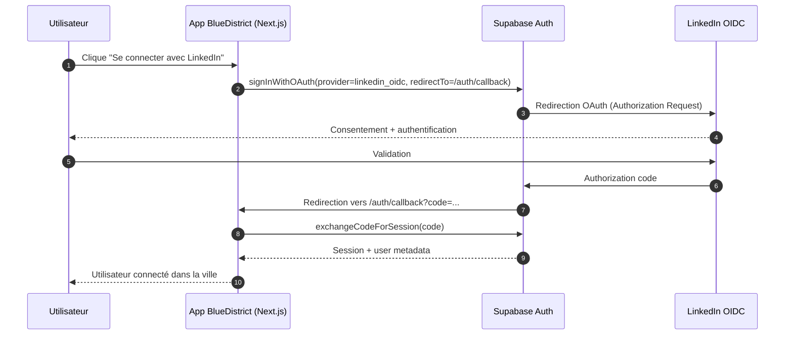

# Schéma Auth — LinkedIn OIDC ↔ Supabase ↔ BlueDistrict

## Vue d'ensemble

BlueDistrict délègue l'authentification OAuth/OpenID Connect à Supabase, qui gère les échanges sécurisés avec LinkedIn et renvoie une session côté app.

## Points de sécurité

- Aucun secret LinkedIn n'est exposé côté client.
- Le callback OAuth est traité côté serveur via `@supabase/ssr`.
- Les variables sensibles restent en `.env.local` et ne sont jamais commitées.
- Les redirect URLs sont explicitement whitelistées côté LinkedIn et Supabase.

## Checklist de validation

1. Provider LinkedIn OIDC activé dans Supabase
2. Redirect URL LinkedIn = `https://<project>.supabase.co/auth/v1/callback`
3. Site URL Supabase = `http://localhost:3000`
4. Redirect app = `http://localhost:3000/auth/callback`
5. Test login complet sans erreur
